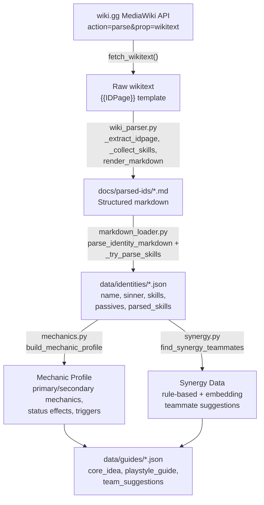

# Data Strategy (D5)

This document covers data source, lineage, pre-processing pipeline, and exploratory data analysis for the Limbus Company Auto Guides NLP project.

---

## 1. Data Source

| Property | Value |
|----------|-------|
| **Origin** | [limbuscompany.wiki.gg](https://limbuscompany.wiki.gg) — the official community wiki for Limbus Company (Project Moon, 2023–present) |
| **Access method** | MediaWiki REST API — `action=parse&prop=wikitext` — returns structured wikitext, not raw HTML |
| **API endpoint** | `https://limbuscompany.wiki.gg/api.php` |
| **Fetch rate** | One HTTP request per identity page; no rate-limit issues at this scale |
| **Format** | MediaWiki template markup (`{{IDPage|...}}`, `{{UptieSkills|...}}`) — structured key-value parameters |

**Why wikitext over HTML scraping:** The wiki's page HTML is presentation-layer markup with inconsistent CSS classes. The `action=parse&prop=wikitext` endpoint returns the underlying template structure, which maps cleanly to the identity schema (skills, passives, stats) without fragile CSS selectors.

**Code entry points:**
- [`src/limbus_guides/ingestion/wiki_parser.py`](src/limbus_guides/ingestion/wiki_parser.py) — `fetch_wikitext(page_title)` fetches and `render_markdown()` converts to structured markdown
- [`scripts/fetch_wiki_identities.py`](scripts/fetch_wiki_identities.py) — batch fetch CLI; accepts a list of wiki page URLs

---

## 2. Data Lineage

| Aspect | Detail |
|--------|--------|
| **License** | limbuscompany.wiki.gg content is community-maintained under the wiki's terms of use; game mechanics text is factual/functional content |
| **Use case** | Academic NLP course project — internal analysis only, no public redistribution of wiki content |
| **PII** | None — all records are game-mechanic descriptions (skill names, status effects, numeric values); no player data, no user accounts |
| **Storage** | `docs/parsed-ids/*.md` (intermediate markdown), `data/identities/*.json` (structured JSON), `data/guides/*.json` (generated output) — all local |
| **Retention** | Project repository only; data is re-fetchable from the public wiki at any time |

No consent or ethics review is required; all source material is publicly accessible game documentation.

---

## 3. Pre-processing Pipeline



### Stage details

| Stage | Script / Module | Input | Output |
|-------|----------------|-------|--------|
| **Fetch** | `wiki_parser.py` → `fetch_wikitext()` | wiki page title | raw wikitext string |
| **Parse wikitext** | `wiki_parser.py` → `render_markdown()` | raw wikitext | `docs/parsed-ids/<slug>.md` |
| **Ingest markdown** | `markdown_loader.py` → `parse_identity_markdown()` | `.md` file | identity dict with `parsed_skills` |
| **Mechanic extraction** | `mechanics.py` → `build_mechanic_profile()` | identity dict | mechanic profile (spaCy EntityRuler + regex) |
| **Synergy analysis** | `synergy.py` → `find_synergy_teammates()` | identity + full roster | synergy list (rule-based + MiniLM embeddings) |
| **Guide generation** | `generation.py` → `generate_guide()` | identity + synergies | `data/guides/<slug>.json` |
| **Full pipeline** | `scripts/run_pipeline.py` | — | all guides regenerated |

### Key parsing decisions

- **Multi-state identities** (e.g. Ring Apprentice Faust in Iron Maiden → Flow State): `markdown_loader.py` detects section boundaries; `skill_parser.py` separates skill sets by state.
- **Ownership markers** (`(×4 Owned)`): filtered out of skill descriptions to avoid contaminating parsed skill bonuses.
- **Windows-safe filenames**: `::` in E.G.O identity titles (e.g. `Lobotomy E.G.O::Magic Bullet`) is replaced with `_` in `wiki_parser.page_title_to_filename()`.

---

## 4. Exploratory Data Analysis

Dataset as of July 2026. Regenerate with:

```python
python -c "
import json, pathlib, collections
guides = [json.loads(p.read_text(encoding='utf-8'))
          for p in pathlib.Path('data/guides').glob('*.json')
          if p.name != 'manifest.json']
print(len(guides), 'guides')
"
```

### Dataset size

| Metric | Value |
|--------|-------|
| Identities (parsed and guided) | 50 |
| Sinners covered | 12 / 12 |
| Average skills per identity | 3.4 |
| Min / Max skills per identity | 3 / 6 |
| Evaluation reference texts | 50 |

### Mechanic frequency (raw markdown mentions across all 50 identities)

Counts reflect how many times each mechanic term appears in parsed markdown — a proxy for prominence in the current dataset.

| Rank | Mechanic | Count | Category |
|------|----------|-------|----------|
| 1 | Coin Power | 369 | Stat Modifier |
| 2 | **Bleed** | 269 | Status Effect |
| 3 | Base Power | 251 | Stat Modifier |
| 4 | **Tremor** | 223 | Status Effect |
| 5 | Atk Weight | 189 | Stat Modifier |
| 6 | **Burn** | 168 | Status Effect |
| 7 | **Rupture** | 131 | Status Effect |
| 8 | **Poise** | 116 | Status Effect |
| 9 | **Sinking** | 61 | Status Effect |
| 10 | Unbreakable Coin | 55 | Unique Mechanic |
| 11 | Clash Power | 46 | Stat Modifier |
| 12 | Corpus Ingredient | 37 | Unique Mechanic |
| 13 | Final Power | 29 | Stat Modifier |
| 14 | Haste | 18 | Status Effect |
| 15 | Defense Level Down | 13 | Stat Modifier |

### Status effect distribution (from mechanic profiles)

Aggregated `status_effects` counts across all 50 guide mechanic profiles.

| Status Effect | Occurrences | % of all status-effect mentions |
|---------------|-------------|--------------------------------|
| Bleed | 268 | 24% |
| Tremor | 220 | 19% |
| Burn | 161 | 14% |
| Rupture | 131 | 12% |
| Poise | 115 | 10% |
| Charge | 115 | 10% |
| Sinking | 61 | 5% |
| Shield | 21 | 2% |
| Haste | 17 | 2% |
| Bind | 14 | 1% |

**Observation:** Bleed and Tremor lead the expanded roster (Heishou, Ring, W Corp, and Kurokumo kits added Tremor/Rupture density). Burn remains strong via Liu and Kurokumo identities. The 50-ID set covers diverse archetypes but is still curated, not a uniform sample of all 172 game identities.

---

*Regenerate all pipeline outputs with `python scripts/run_pipeline.py`. Regenerate evaluation stats with `python scripts/run_evaluation.py`.*
