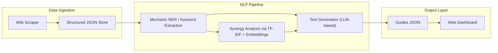

## Project Goal

Build an NLP pipeline that ingests structured character identity data from Limbus Company wiki.gg pages and generates three outputs per identity:
1. Core concept summary (what the identity does, in natural language)
2. Playstyle guide (how to use the identity effectively)
3. Team composition suggestions (which identities synergize)

Results MUST be displayed on a web-based dashboard where users browse by character and identity.

---

## Domain Context

- **Game:** Limbus Company (Project Moon, 2023–present)
- **Characters (Sinners):** 12 playable characters
- **Identities:** 172 total; each character equips exactly one identity per team
- **Core mechanics:** Status effects (Bleed, Burn, Tremor, Rupture, Sinking, Poise, Charge), skill coins, offense/defense levels, passives, support passives, sin affinities — full reference in [`docs/status-effects.md`](status-effects.md). Gameplay overview: [`docs/domain-primer.md`](domain-primer.md)
- **Data source:** [limbus-company.wiki.gg](https://limbus-company.wiki.gg)

---

## Architecture

---

## Module Breakdown

### Module 1 — Data Ingestion

- Scrape identity pages from wiki.gg (HTML parsing via BeautifulSoup or similar)
- Extract per-identity: base stats, skills (coins, effects, conditions), passives, support passives, sin affinities, status effects referenced
- Store as structured JSON (one file per identity or single consolidated file)
- Reference format: `Ring_Apprentice_Faust.md` shows the target structure

### Module 2 — NLP Processing (Core of the Project)

Three NLP tasks, mixing traditional and LLM-based techniques:

**Task A: Mechanic Extraction (Traditional NLP)**
- Named Entity Recognition or rule-based extraction to tag game mechanics in skill/passive text (e.g., "Bleed", "Corpus Ingredient", "Unbreakable Coin", "Bind") — entity dictionary: [`docs/status-effects.md`](status-effects.md)
- Keyword extraction (TF-IDF or RAKE) to identify the dominant mechanics per identity
- Output: per-identity mechanic profile (primary mechanics, secondary mechanics, conditional triggers)

**Task B: Identity Similarity and Team Synergy (Traditional + Embeddings)**
- Compute identity similarity using TF-IDF vectors or sentence embeddings over skill/passive descriptions
- Cluster identities by mechanic archetype (Bleed team, Burn team, Charge team, etc.)
- Detect synergy pairs: identities whose support passives benefit another identity's mechanics (e.g., support passive inflicts Bleed -> pairs with identity that scales off Bleed)
- Output: per-identity list of suggested teammates with synergy reasoning

**Task C: Guide Text Generation (LLM-based)**
- Use extracted mechanic profiles + synergy data as context
- Prompt an LLM (or fine-tuned model) to generate:
  - **Core Idea** (~2-3 sentences): What this identity fundamentally does
  - **Playstyle Guide** (~1 short paragraph): Key decision points, skill priorities, state transitions
  - **Team Suggestions** (~3-5 bullet points): Recommended partners with one-line rationale
- RAG approach: feed structured identity data plus [`domain-primer.md`](domain-primer.md) gameplay rules (`src/limbus_guides/domain/context.py`) as retrieval context
- Evaluate output against manually written guides for a validation subset

### Module 3 — Web Dashboard

- Framework: Streamlit, Gradio, or lightweight Flask app
- Views:
  - Character selector (12 characters) -> identity list for selected character
  - Identity detail page: core idea, playstyle guide, team suggestions
  - (Optional) Compare view: side-by-side identity comparison
- Data served from pre-generated JSON (guides generated offline, dashboard is read-only display)

---

## NLP Techniques Summary

| Technique | Category | Usage |
|-----------|----------|-------|
| HTML parsing + structured extraction | Preprocessing | Wiki page ingestion |
| Named Entity Recognition (custom entities) | Traditional NLP | Game mechanic tagging |
| TF-IDF / RAKE keyword extraction | Traditional NLP | Dominant mechanic identification |
| Sentence embeddings (e.g., sentence-transformers) | Embeddings | Identity similarity computation |
| Clustering (k-means or similar) | Traditional ML | Archetype grouping |
| LLM prompting with structured context | LLM-based | Guide text generation |
| RAG (Retrieval-Augmented Generation) | LLM-based | Wiki JSON + domain primer rules for grounded playstyle text |

---

## Scope Constraints

- Prototype MUST cover a minimum of 20 identities across all 12 characters (at least 1 per character) for demonstration
- Prototype SHOULD support all 172 identities if pipeline is automated
- Team suggestions MUST reference specific identity names, not generic advice
- Generated text MUST be factually grounded in wiki data (no hallucinated mechanics)

---

## Deliverables

1. Source code repository with documented pipeline (`src/limbus_guides/`, `scripts/`)
2. Web dashboard (Streamlit — `src/limbus_guides/dashboard/app.py`)
3. Evaluation report (`docs/evaluation.md`, `data/evaluation_results.json`)
4. **Final presentation:** 10 minutes + 5 minutes professor discussion (Jul 3)
5. (Optional) Streamlit Community Cloud deployment

---

## Final Presentation Crosswalk (D1–D10)

| Rubric | Main deck (10 min) | Repo evidence |
|--------|-------------------|---------------|
| D1 Pitch | Hook + problem (30s) | `deliverable-1-prototype-pitch.md` |
| D2 SOTA | Delta vs chatbots (45s) | `sota.md`, `deliverable-2-state-of-the-art.md` |
| D3 UX | Live demo UI | `dashboard/app.py` |
| D4 Agile | Appendix only | GitHub Projects screenshot |
| D5 Data | Architecture slide | `ingestion/`, `data/identities/` |
| D6 NLP | Methods + 1 I/O (1 min) | `nlp/`, `poc_evaluation_results.json` |
| D7 E2E | Architecture + demo (3–4 min) | `pipeline/run.py` |
| D8 Evaluation | Headline metrics (1 min) | `evaluation.md`, `evaluation_results.json` |
| D9 Optimization | Top fix (45s) | `monitoring/logger.py` |
| D10 Storytelling | 1 lesson (30s) | `final-presentation-outline.md` appendix |

Full slide script: [final-presentation-outline.md](final-presentation-outline.md)

---

## Evaluation Scope (D8)

- **Held-out test set:** 20–50 identity guide examples (pilot: 3 parsed IDs)
- **Metrics:** ROUGE-L (generation), mechanic-tag F1 (extraction)
- **Baselines:** naive template; ablation without synergy context
- **Efficiency:** latency and cost per query at 100 / 1k / 10k scale
- **User study:** SUS questionnaire, 3–8 participants, task success rate

---

## RAG Approach

The pipeline uses **structured JSON/markdown context injection** — the full identity record is passed to the LLM prompt. No vector database or chunking is required at prototype scale because wiki data is already structured per identity.

---

## Tech Stack (Suggested)

- **Language:** Python
- **Scraping:** BeautifulSoup / requests
- **NLP:** spaCy (NER), scikit-learn (TF-IDF, clustering), sentence-transformers (embeddings)
- **LLM:** OpenAI API / local model via Hugging Face
- **Web:** Streamlit or Gradio
- **Data format:** JSON

