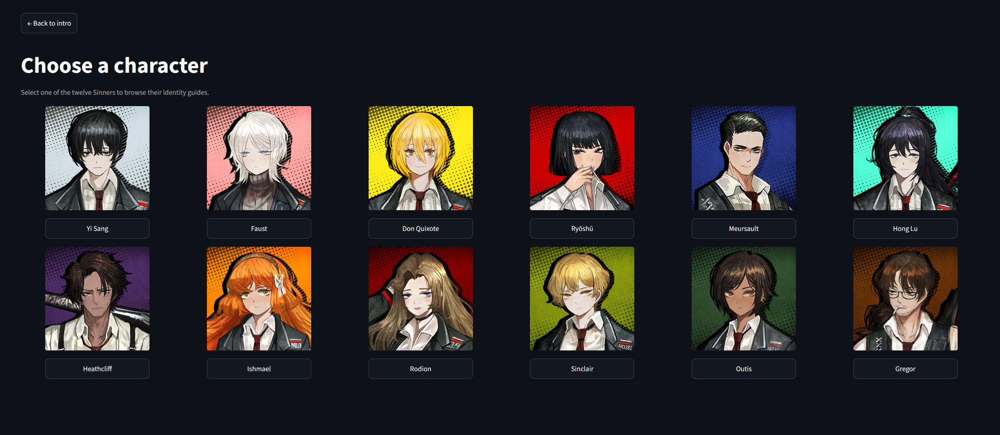
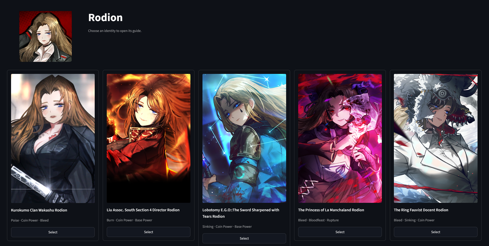
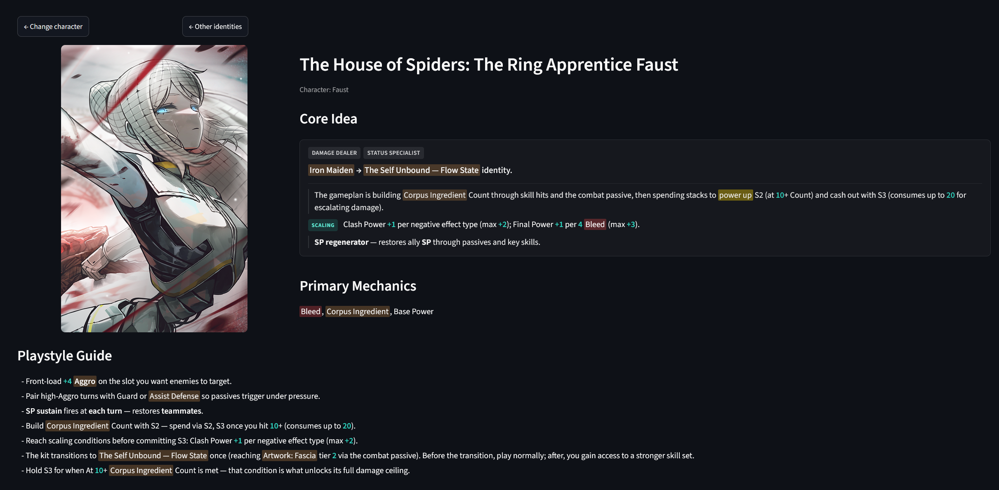
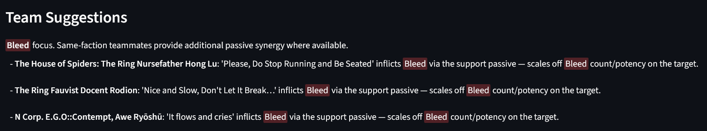
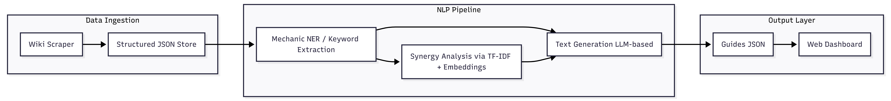

# Limbus Company Auto Guides — Term Paper

**Student:** Danil Shavarin  
**Course:** Natural Language Processing (NLP)  
**Project:** Limbus Company Auto Guides  
**Date:** July 2026  

**Live demo:** https://limbus-company-nlp-guides.streamlit.app  
**Repository:** https://github.com/OldBoom/Limbus-Company-Auto-Guides  

---

## 1. Introduction and Project Scope

### 1.1 Problem statement

*Limbus Company* is a turn-based squad battler where each of the 12 playable characters can use many different **identities** — full combat kits with skills, passives, and team-wide support effects. Players need to understand what an identity does, how to play it, and which teammates work well with it. The main source for this information is the fan wiki at [limbus-company.wiki.gg](https://limbus-company.wiki.gg).

The problem is that wiki pages are long and dense. Important mechanics are spread across skill tables, passive descriptions, and footnotes. A player who only wants a quick answer — “what is this identity about?” or “who should I pair with it?” — must read a lot of text and still risk misunderstanding the kit. Community tier lists exist, but they rarely explain *why* two identities work together.

This project tries to solve that gap with an NLP pipeline. It reads structured identity data from the wiki, extracts game mechanics, finds synergy between identities, and writes short guides in a fixed format. The results are shown on a web dashboard where the user picks a character, picks an identity, and reads three sections: **Core Idea**, **Playstyle**, and **Team suggestions**.

### 1.2 Target user and use case

The primary user is a *Limbus Company* player who plays regularly — for example when preparing teams for Mirror Dungeon runs or when choosing which identity to invest in. This player does not want to decode raw skill text every time. They want:

- a short summary of the identity’s main role and loop;
- practical playstyle notes (what to prioritise in combat);
- teammate suggestions with a clear reason, not just names.

The system is assistive, not authoritative. It helps the player start faster; it does not replace the wiki or personal experience.

### 1.3 Why this problem is relevant

Team-building in *Limbus Company* depends on status effects (Bleed, Burn, Tremor, and others), support passives, and conditional skill triggers. Missing one line in a passive can lead to a bad team pick. Wiki pages contain the facts, but the **reading cost** is high, especially for newer identities with many unique keywords.

An automated guide that stays close to extracted wiki data can:

- save time when comparing identities;
- reduce misreads of core mechanics;
- make synergy visible through short, grounded teammate lines instead of opaque tier rankings.

For an NLP course, this is also a realistic end-to-end text problem: ingest noisy semi-structured text, extract entities and relations, generate readable output, and evaluate both automatically and with users.

### 1.4 Proposed solution (input → processing → output)

The system follows a linear pipeline:

1. **Input** — identity pages from the wiki, fetched via the **MediaWiki wikitext API** and stored as curated markdown in `docs/parsed-ids/`, then converted to structured JSON (`data/identities/`).
2. **NLP processing** — mechanic tagging (spaCy EntityRuler and regex), skill parsing, archetype detection, embedding-based similarity, and rule-based synergy from support passives (`src/limbus_guides/nlp/`).
3. **Output** — one guide JSON per identity (`data/guides/`) with three sections, rendered by a **Streamlit** dashboard.

Guides are generated **offline** by `scripts/run_pipeline.py` and loaded by the dashboard at runtime. That keeps the demo fast and avoids API cost during presentation.

The public demo runs on Streamlit Community Cloud: [limbus-company-nlp-guides.streamlit.app](https://limbus-company-nlp-guides.streamlit.app). The same code and pre-built guide files are available in the GitHub repository.

### 1.5 Objectives and scope

The original SMART goal for the course prototype was:

| Criterion | Target |
|-----------|--------|
| **Specific** | End-to-end pipeline: wiki data → JSON → mechanics → synergy → guide text → dashboard |
| **Measurable** | >= 20 identities, >= 1 per character, all 3 guide sections complete, dashboard load <= 2 s locally |
| **Achievable** | Python stack (spaCy, sentence-transformers, templates); optional local LLM via Ollama |
| **Relevant** | Demonstrates extraction, similarity, grounded generation, and evaluation |
| **Time-bound** | Final demo and documentation by **3 July 2026** |

**What was delivered:** the prototype covers **51 identities across all 12 characters**, each with Core Idea, Playstyle, and Team suggestions. The pipeline runs in about one second per identity on a local machine. **84 automated tests** pass in the repository. The SMART minimum was exceeded on coverage; full wiki coverage (172 identities) remains future work.

**Sub-goals that were met:**

- reliable extraction of stats, skills, passives, support passives, and sin affinities;
- mechanic tagging for common status effects and trigger phrases;
- teammate recommendations with reasons tied to support-passive rules;
- offline guide generation with a read-only dashboard.

### 1.6 Non-goals

The following were explicitly out of scope:

- **No combat simulator** — the system does not predict damage or optimise full rotations.
- **No meta tier list** — guides explain kits and synergy, not “best identity” rankings.
- **No full 172-identity coverage** for the course deadline (51 is the shipped set).
- **No production hardening** — academic prototype; no mobile app or enterprise deployment requirements.
- **No model training from scratch** — the shipped guides use rule-based templates and structured fields; an optional Ollama path exists but is not required for the demo.

### 1.7 Report structure

The rest of this paper is organised as follows. **Section 2** reviews related tools and common NLP approaches for game guides. **Section 3** describes the user experience, data sources, and basic dataset statistics. **Section 4** presents the system architecture and development methodology. **Section 5** explains the technical implementation and main design iterations. **Section 6** reports quantitative metrics and the usability study. **Section 7** discusses limitations, ethics, and lessons learned. **Section 8** summarises the outcomes and outlines future work.

---

## 2. State of the Art and Related Work

### 2.1 Similar products and prototypes

This project sits between two common ideas: **wiki assistants** that answer questions with an LLM, and **team builders** that score party combinations. Few existing tools produce a **fixed guide per game character** with synergy explanations grounded in wiki data. Three nearby examples illustrate the landscape.

| Project | What it does | Main limitation |
|---------|--------------|-----------------|
| **BG3Chat** | Baldur's Gate 3 wiki RAG chatbot in Streamlit | Free-form Q&A; no fixed Core Idea / Playstyle / Team schema |
| **GameWiki** | In-game overlay; Gemini RAG wiki Q&A | Chat interface only; not structured per-identity guides |
| **genshin-team-builder** | Scores teams by elemental rules; LLM explains picks | Built for Genshin reactions; not Limbus wiki parsing |

: Related tools compared to this project. {#tbl-related tbl-colwidths="[0.16,0.38,0.46]"}

RAG chatbots are useful for exploration (“what does this skill do?”), but they do not guarantee the same output shape every time. Team optimisers for other games assume different mechanics (elemental reactions, role tags) and often use curated databases instead of parsing fan wikis.

For *Limbus Company*, identities rely on status stacks, coin effects, multi-state skills, and **support passives** that affect the whole team. That combination needs structured extraction first, then synergy rules — not only vector search over raw wiki chunks.

### 2.2 Common technical patterns

Looking at projects like the ones above, a similar architecture appears often:

- **Ingestion** — HTTP requests plus HTML or wikitext parsing to get page content.
- **Knowledge store** — either chunked documents for retrieval, or structured JSON when the schema is known.
- **Similarity** — sentence embeddings (e.g. sentence-transformers) and cosine similarity; sometimes a vector database (FAISS, Chroma) at larger scale.
- **Generation** — LLM with retrieved context (RAG), often in two steps: extract facts, then write prose.
- **UI** — Streamlit or Gradio for a quick prototype.

These patterns are reusable. This project borrows the **fact-first, then generate** idea to reduce hallucination, and the **score teammates, then explain** pattern from team builders. It does **not** copy a pure chatbot design, because the course goal is predictable, browsable guides — not open-ended dialogue.

### 2.3 NLP approaches considered for this domain

Game-wiki extraction can use HTML parsing, MediaWiki APIs, datamined game files, or LLM-assisted scraping. For wiki.gg identity pages, the project uses the **MediaWiki wikitext API** plus a fixed parsing schema (`docs/parsed-ids/` → JSON). Datamined game files (used by some community tools) were out of scope: they lack flavour text and raise legal concerns. LLM extraction on already-structured tables would add cost without clear benefit.

For **mechanic tagging** (Bleed, Burn, “[On Hit]”, and similar), the vocabulary is small and well-defined. PoC tests in `notebooks/ner_evaluation.ipynb` showed that **rule-based matching** (spaCy PhraseMatcher and regex) reached much higher F1 than an untuned EntityRuler on overlapping spans. Statistical NER would need many manual labels. The production pipeline therefore uses **pattern-based tagging**, not a trained NER model.

For **identity similarity** (archetype clustering and teammate shortlists), the project compares sentence embeddings locally. PoC tests (`notebooks/embedding_evaluation.ipynb`) compared `all-MiniLM-L6-v2`, `all-mpnet-base-v2`, and `bge-small-en-v1.5` on three pilot identities. All models separated Bleed-focused kits from a Poise-focused kit, but **mpnet** showed the largest margin. At the current scale (51 identities), a **vector database is not required** — pairwise similarity in memory is fast enough.

For **guide text**, several local LLMs were tested via Ollama (Mistral 7B, Llama 3, Phi-4) with structured identity context. Grounding checks passed when the JSON was provided as context. The **shipped demo** uses **template-based generation** from parsed fields instead: zero API cost, reproducible output, and easier evaluation. The Ollama path remains optional for future polish.

### 2.4 This project’s contribution

The main difference from existing chatbots and generic team tools is the **output contract** and the **pipeline order**:

1. **Structured-first** — parse wiki into a consistent identity schema before any generation.
2. **Fixed guide schema** — every identity gets Core Idea, Playstyle, and Team suggestions (not free-form answers).
3. **Hybrid synergy** — teammate picks combine embedding similarity with explicit rules on support passives and mechanic triggers.
4. **Grounding by design** — generated sentences are built from extracted mechanics and parsed skill effects; the model does not invent new status effects.
5. **Browse-first UX** — character → identity → three sections on a dashboard, with a public deploy for demos.

In short, the contribution is not a new LLM technique, but an **end-to-end, wiki-grounded guide generator** for a complex game domain where structure and synergy matter as much as fluent text. Sections 4 and 5 describe how this was implemented; Section 6 reports whether the output quality and usability were good enough for players.

---

## 3. Concept, UX, and Data Strategy

### 3.1 User experience design

The dashboard is built for **browsing**, not chatting. A player should reach a readable guide in a few clicks without typing a prompt.

The interface has four stages:

1. **Landing** — short project title and entry to the roster.
2. **Sinner grid** — all 12 playable characters as portrait cards.
3. **Identity picker** — every covered identity for the chosen character.
4. **Guide view** — three sections: **Core Idea**, **Playstyle**, and **Team suggestions**.

The guide page uses formatted HTML for the Core Idea block. Role tags (for example `[DPS — Bleed]`) appear at the top. Game mechanics such as Bleed or Tremor are **colour-coded** so they stand out from normal text. Long kits may split into labelled parts (Scaling, Support, Variance) when the parser detects those patterns.

Team suggestions are not plain bullet text, because each teammate line can link to that identity’s guide (`?identity=<slug>`), so the user can jump between related kits without returning to the grid. This matches the use case from Section 1: compare synergies quickly while preparing a team.

Guides are **pre-generated** and stored as JSON. The hosted demo loads these files directly, so pages open in under two seconds with no live LLM call. That design was chosen for stable demos and zero runtime API cost.









*Figure 1–4: Streamlit dashboard at [limbus-company-nlp-guides.streamlit.app](https://limbus-company-nlp-guides.streamlit.app). Core Idea example: Ring Apprentice Faust.*

### 3.2 Data source

All identity facts come from the community wiki [limbuscompany.wiki.gg](https://limbuscompany.wiki.gg).

| Property | Detail |
|----------|--------|
| **Access** | MediaWiki API — `action=parse&prop=wikitext` |
| **Endpoint** | `https://limbuscompany.wiki.gg/api.php` |
| **Format** | Template markup (`{{IDPage|...}}`, skill templates) |
| **Fetch rate** | One HTTP request per identity page |

**Why wikitext instead of HTML scraping:** the rendered HTML uses layout CSS that changes often. The wikitext endpoint returns the underlying template parameters — skills, passives, stats — in a more stable structure. The parser in `wiki_parser.py` converts this to markdown in `docs/parsed-ids/`, then `markdown_loader.py` builds JSON in `data/identities/`.

New identities can be added with `scripts/fetch_wiki_identities.py` or `scripts/add_identity.py` when a wiki URL is known.

### 3.3 Data lineage, privacy, and use

| Aspect | Detail |
|--------|--------|
| **License** | Community wiki under the site’s terms; text describes public game mechanics |
| **Purpose** | Academic NLP course project — analysis and prototype guides |
| **PII** | None — no player accounts or personal data |
| **Storage** | Local repo: parsed markdown, identity JSON, guide JSON |
| **Retention** | Data can be re-fetched from the public wiki at any time |

No special consent process was needed: the source is public game documentation. The project does **not** claim to be official Project Moon content. Guides are summaries for learning and team prep, not a replacement for the wiki or in-game tooltips.

### 3.4 Pre-processing overview

Data moves through a fixed chain before NLP runs:

```
Wiki API (wikitext) → docs/parsed-ids/*.md → data/identities/*.json
→ mechanic profile + synergy → data/guides/*.json → Streamlit
```

Important parsing choices:

- **Multi-state identities** (e.g. kits that change skills mid-fight): section boundaries in markdown; `skill_parser.py` keeps skill sets per state.
- **Ownership markers** like `(×4 Owned)` are stripped so they do not pollute parsed bonuses.
- **Windows-safe filenames**: characters such as `::` in E.G.O titles are replaced for file paths.

Section 4 describes the full architecture; Section 5 covers the NLP modules in more detail.

### 3.5 Exploratory data analysis

The current dataset (July 2026) includes **51 identities** and **all 12 sinners**. Each identity has an average of about **3.4 skills** (minimum 3, maximum 6). Every identity has a complete guide with all three sections.

**Status effects in mechanic profiles** (aggregated across the dataset):

| Status effect | Share of mentions |
|---------------|-------------------|
| Bleed | 24% |
| Tremor | 19% |
| Burn | 14% |
| Rupture | 12% |
| Poise | 10% |
| Charge | 10% |
| Other (Sinking, Shield, Haste, Bind, …) | 11% |

Bleed and Tremor are the most common combat themes in this curated set. That reflects which identities were added for the prototype (Ring, Heishou, Kurokumo, Liu, and others) — not a uniform sample of all **172** game identities.

**Text length:** skill and passive descriptions vary from short single-line effects to long multi-coin paragraphs. Multi-state kits produce the longest source text and required the most parser work. The guide generator compresses this into a short Core Idea (typically a few sentences) plus a brief Playstyle block.

This EDA confirms two design points: (1) status-effect tagging is central to almost every identity; (2) the dataset is diverse enough to test synergy rules and archetype wording, but still a **subset** of the full game roster.

---

## 4. System Architecture and Methodology

### 4.1 Architecture overview

The system has three layers: **data ingestion**, **NLP processing**, and **output display**. Data flows in one direction. The dashboard never calls the wiki or an LLM at runtime in the shipped demo.

```
Wiki API → parsed markdown → identity JSON → NLP modules → guide JSON → Streamlit
```



*Figure 5: End-to-end pipeline (three layers). Shipped demo uses template generation; Ollama is optional.*

**Layer 1 — Data ingestion** (`src/limbus_guides/ingestion/`)

- `wiki_parser.py` fetches wikitext from the MediaWiki API and renders structured markdown into `docs/parsed-ids/`.
- `markdown_loader.py` reads those files and produces identity JSON: stats, skills, passives, support passives, sin affinities, and parsed skill fields.
- `unique_mechanics_registry.py` registers new identity-specific keywords when they appear in source text.

**Layer 2 — NLP processing** (`src/limbus_guides/nlp/`)

- `mechanics.py` builds a mechanic profile (status effects, triggers, primary/secondary tags).
- `keywords.py` runs TF-IDF over the roster for dominant terms per identity.
- `skill_parser.py` and `archetypes.py` interpret coin effects and assign kit archetypes (Bleed, Burn, Tremor, ammo kits, and others).
- `synergy.py` scores teammate candidates with embedding similarity plus support-passive rules.
- `generation.py` writes Core Idea, Playstyle, and Team suggestions (templates by default; optional Ollama).

**Layer 3 — Output** (`data/guides/`, `src/limbus_guides/dashboard/`)

- Each identity gets one JSON file with all guide fields and synergy metadata.
- `app.py` (Streamlit) loads pre-built JSON and renders the browse UI from Section 3.

The orchestrator is `src/limbus_guides/pipeline/run.py`, exposed as `scripts/run_pipeline.py`. One command regenerates the full roster.

### 4.2 Component hand-offs

| Step | Input | Module / artefact | Output |
|------|--------|-------------------|--------|
| 1 | Wiki page title | `fetch_wikitext()` | Raw wikitext string |
| 2 | Wikitext | `render_markdown()` | `docs/parsed-ids/<slug>.md` |
| 3 | Markdown file | `parse_identity_markdown()` | `data/identities/<slug>.json` |
| 4 | Identity JSON | `build_mechanic_profile()` | Mechanic profile dict |
| 5 | Full roster | `find_synergy_teammates()` | Ranked teammate list + reasons |
| 6 | Identity + synergies | `generate_guide()` | `core_idea`, `playstyle_guide`, `team_suggestions` |
| 7 | Guide JSON files | Streamlit `app.py` | Rendered web pages |

There is **no vector database** at prototype scale. Each identity record is small and self-contained, so the generator receives the full structured JSON as context (structured RAG) instead of retrieved chunks.

### 4.3 Deployment model

**Local development:** `scripts/setup.cmd` creates a virtual environment; `run_pipeline.py` builds guides; `streamlit run src/limbus_guides/dashboard/app.py` serves the UI.

**Public demo:** the app is deployed on **Streamlit Community Cloud** at [limbus-company-nlp-guides.streamlit.app](https://limbus-company-nlp-guides.streamlit.app). The cloud instance reads the same pre-generated `data/guides/*.json` files from the repository. Guide text is produced offline on the developer machine (or in CI), not on each user visit. That gives:

- fast page loads for presentations;
- no API keys or GPU on the server;
- reproducible output pinned to a git commit.

If wiki data changes, the maintainer re-runs the pipeline locally and pushes updated JSON.

### 4.4 Development methodology

The project was planned with **MoSCoW prioritisation** (Must / Should / Could / Won’t). The table below lists the **Must** stories that shaped the architecture. Full backlog had 18 stories; only the Must items needed to pass the course prototype are summarised here.

| ID | User story (short) | Status |
|----|-------------------|--------|
| US-01 | Browse sinners on the dashboard | Done |
| US-02 | Open an identity and read three guide sections | Done |
| US-03 | Ingest parsed markdown to JSON | Done (51 identities) |
| US-05 | Extract game mechanics | Done (rule-based NER) |
| US-06 | Compute identity similarity | Done (embeddings) |
| US-07 | Suggest synergy teammates with reasons | Done |
| US-08 | Generate grounded guide text | Done (templates; Ollama optional) |
| US-09 | Run end-to-end pipeline from one CLI | Done |
| US-10 | Launch Streamlit dashboard | Done |
| US-14 | ROUGE-L evaluation on reference set | Done |
| US-15 | SUS usability study | Done (n=7) |

**Should** items (wiki batch scrape automation, PoC notebooks for NER/embeddings/LLM) were completed where they supported decisions in Section 2. **Could** items (request latency logging) and full **172-identity** scrape were deferred.

Work proceeded in short iterations: ingestion first, then mechanic extraction, then synergy and generation, then dashboard and evaluation. Each stage had unit tests in `tests/` before adding the next module.

### 4.5 Design decisions tied to architecture

Two choices matter for maintainability:

1. **Offline generation, read-only UI** — separates heavy NLP from the demo surface and matches how game data updates (batch refresh, not live wiki calls).
2. **Structured JSON contract** — every module reads and writes predictable fields, so `run_for_slug()` can regenerate a single identity after a parser fix without touching the whole repo manually.

Section 5 goes deeper into the NLP implementation and the main wording fixes that came from evaluation feedback.

---

## 5. Technical Implementation

This section describes how the NLP modules work. Section 4 showed *where* data flows; here the focus is *what each step computes*.

### 5.1 Baseline and full system

Three guide variants were built for evaluation:

| Variant | What it uses | Role |
|---------|----------------|------|
| **Naive** | Mechanic keywords only | Lower bound — no skill parsing |
| **Ablation** | Skill-aware templates, no synergy in team text | Tests whether synergy changes ROUGE |
| **Full** | Templates + skill parsing + synergy rules | Shipped system |

The naive baseline scored ROUGE-L **0.109**. The full system scored **0.175** — a gain of **0.066**. Ablation was almost the same as full (**0.176**), because ROUGE measures Core Idea and Playstyle more than `team_suggestions`. Synergy still matters for users even when the metric barely moves.

### 5.2 Mechanic extraction

`mechanics.py` tags game terms in skill and passive text. The vocabulary comes from `docs/status-effects.md`: core status effects (Bleed, Burn, Tremor, …), stat modifiers (Coin Power, Clash Power, …), and identity-specific resources (Corpus Ingredient, Magic Bullet, Courier Trunk, and others).

The implementation uses **spaCy EntityRuler** with a regex fallback. Each identity gets a **mechanic profile**: primary and secondary mechanics, status effect counts, and trigger phrases like `[On Hit]`. This profile feeds both synergy rules and the opening lines of the Core Idea.

PoC tests (`notebooks/ner_evaluation.ipynb`) compared rule matching to EntityRuler on overlapping spans. Rule-based tagging won on F1 for the pilot set, so no statistical NER model was trained.

### 5.3 Skill parsing and archetypes

`skill_parser.py` reads coin lines, on-use effects, and passive blocks from markdown. It handles edge cases that appeared in real kits:

- **Multi-state skills** — separate skill lists per combat state.
- **Ammo economies** — tracks spend and reload for ammo-style identities.
- **Defense skills** — guard actions that queue follow-up attacks.

`build_gameplan()` combines parsed skills, passives, and archetype detectors into one dict (`gp`). Archetype helpers in the same module flag kit families: Poise scaling, Charge payoffs, Minus Coin despair loops, Devyat' Courier retreat, and more. `archetypes.py` adds sin-affinity and support-passive patterns (for example deploy-order buffs).

The gameplan dict is the single input for guide text. Adding a new kit type usually means one new detector plus one branch in `_build_core_idea()`.

### 5.4 Synergy detection

`synergy.py` builds teammate suggestions in two passes.

**Rules first.** Regex patterns match support passives that inflict or scale off statuses. Faction prefixes (Kurokumo, Devyat', The Ring, …) boost related teammates. Special cases exist for faction-locked pairs (for example Heishou Pack → Lord of Hongyuan).

**Embeddings second.** `similarity.py` encodes skill and passive text with sentence-transformers and ranks similar identities. Rules fill high-confidence picks; embeddings add variety when rules under-cover the roster.

Each suggestion includes an identity name and a one-line reason tied to a passive or mechanic — not a generic “good synergy” label.

### 5.5 Guide generation

`generation.py` writes the three dashboard sections. The shipped path uses **Python templates**, not a live LLM.

**Core Idea** is assembled in `_build_core_idea()`. The function picks an opening “hook” based on the strongest archetype (resource loop, Poise, ammo kit, Devyat Courier, etc.). Scaling text is added in a fixed place so the dashboard can render a separate **Scaling** block:

```python
# generation.py — assembly order (simplified)
if scaling := _scaling_conditions_sentence(gp):
    parts.append(scaling)
parts.extend(post_scaling)
```

`_scaling_conditions_sentence()` reads parsed `damage_conditions` or combined mutlti-status patterns. Kit-specific openers (Thumb ammo, Devyat courier) supply the hook only; they do not repeat scaling lines. This refactor fixed layout breaks where scaling text sat inside one long sentence.

**Playstyle** turns parsed coin effects into short player instructions via `_advise_line()` — for example, “hold back until 3+ Bleed” instead of raw wiki tooltip wording.

**Team suggestions** format synergy dicts as markdown bullets with links to other identities.

`generate_guide()` also loads optional context from `domain/context.py` (game rules from `domain-primer.md`). An **Ollama** path exists (`use_ollama=True`) for experiments; production runs use `use_ollama=False`.

### 5.6 Cost and speed

Generation is local and free. Over 50 identities, mean pipeline time is about **1 second per identity** (spaCy + embeddings dominate; template string work is under 1 ms per guide). No API keys are required for the course demo.

### 5.7 Iterations after evaluation

Several fixes came from manual review and user feedback, not from higher ROUGE alone:

- **Thumb ammo kits** — split hook, scaling, and kit details into separate sentences for the Core Idea card.
- **Devyat' Courier** — dedicated opener for Courier Trunk threshold and Strategic R&R retreat loop.
- **Tremor subtypes** — bold labels like `Tremor — Subtype` for Ring and related kits.
- **Core Idea formatter** — `text_format.py` maps sentences to HTML blocks (role tag, Scaling, Support, Variance).

Each fix has a regression test in `tests/test_pipeline.py` (84 tests total) so parser changes do not break earlier identities.

Section 6 reports ROUGE, latency, and the SUS usability study on the full system.

---

## 6. Evaluation and Results

### 6.1 Evaluation setup

The system was tested in two ways: **automatic metrics** on written references, and a **user study** on the live dashboard.

**Reference set.** Fifty human-written summaries in `data/evaluation/references/` — one per identity, two to four sentences each. They describe Core Idea content (role, main loop, key scaling). ROUGE-L compares generated `core_idea` and `playstyle_guide` text to these references.

**Metrics used:**

| Metric | What it measures |
|--------|------------------|
| ROUGE-L | Word overlap between generated guide and reference text |
| Mechanic-tag F1 | Extraction accuracy on a small gold set (PoC) |
| SUS (0–100) | Perceived usability of the dashboard |
| Task success | Whether participants complete three guided tasks |

ROUGE-L does not judge teammate quality well, because synergy text lives mainly in `team_suggestions`. The user study was added to cover navigation and synergy understanding.

### 6.2 Generative quality (ROUGE-L)

Results from `data/evaluation_results.json` (50 identities, three system variants):

| System | ROUGE-L mean | Notes |
|--------|--------------|-------|
| Naive | **0.109** | Keywords only |
| Full | **0.175** | Skill parsing + synergy |
| Ablation | **0.176** | Full pipeline without synergy in team text |

The gap between naive and full is **+0.066**. Skill-aware templates clearly beat keyword stuffing. Ablation and full are almost equal, which matches the design: Core Idea and Playstyle come from `skill_parser` and archetypes; synergy mostly changes team bullets.

**Example (Ring Apprentice Faust).** A naive line might list “Bleed, Corpus Ingredient” with no structure. The full Core Idea names the state transition (Iron Maiden → Flow State), the resource loop (build Corpus Ingredient, spend on S2/S3), and separate scaling lines for negative effects and Bleed — closer to the reference summary.

When the test set grew from 29 to 50 identities, the mean ROUGE stayed near **0.175**, so results did not collapse at larger coverage.

### 6.3 Mechanic extraction (PoC)

On three pilot identities (`data/poc_evaluation_results.json`), rule-based tagging reached average F1 **0.86** (Faust 0.96, Pointillist 0.95, Salsu 0.67). Untuned EntityRuler on the same spans scored much lower on precision because of overlapping matches. This supported the production choice in Section 5.2.

### 6.4 Efficiency and cost

Measured over 10 runs × 50 identities (generation only):

| Metric | Value |
|--------|-------|
| Mean latency per identity | **1,061 ms** |
| Worst case per identity | **1,136 ms** |
| Mean total for 50 identities | **~53 s** |
| Cost per query | **€0** (local templates) |

Most time goes to spaCy tagging and embedding similarity in `synergy.py`. Template string assembly is under 1 ms per guide.

### 6.5 Error review

Manual checks used four error types:

| Category | Count (last run) | Comment |
|----------|------------------|---------|
| Hallucination | 0 | Templates tied to parsed JSON |
| Synergy miss | 1 | Small roster limits some rule matches |
| Retrieval miss | N/A | No vector DB |
| Formatting | 0 | Fixed JSON schema |

Hallucination was the main risk at project start. Structured templates and parsed fields kept it near zero on the evaluated set.

### 6.6 Usability study (SUS)

**Setup.** Seven participants used the hosted app ([limbus-company-nlp-guides.streamlit.app](https://limbus-company-nlp-guides.streamlit.app)). Each person had three tasks: (1) find a given identity’s guide, (2) name its primary mechanic, (3) name one suggested teammate and why.

**Results:**

| Metric | Result |
|--------|--------|
| Participants | 7 |
| Task success | **21 / 21** (100%) |
| Mean SUS | **90.4** (range 80.0–97.5) |
| Mean session time | ~2.9 min |
| Unaided completion | 6 / 7 |

One participant (P4, never played, weak English) needed help with reading only. All others finished without assistance. The course target was SUS >= 70; the mean is well above that and above the common industry average (~68).

During the study, three UI fixes shipped (colour-coded mechanics, clickable teammate links, tab behaviour). That may have raised scores for later sessions. But ulimately, simplicity of the UI made it easy and intuitively understandable, which led to pertisipants having positive experience.

### 6.7 Participant feedback

Two quotes capture the main themes:

> *"System is very easy to navigate, the core ideas of each id are easy to understand, even when only skimmed."* — P2

> *"Rapidly navigate through walls of text"* — P3 (after comparing to the wiki)

Players who do not use the wiki (P1, P2, P5, P6) still completed tasks quickly. Players who compared sources (P3, P4, P7) rated the dashboard **better than the wiki** for quick understanding. The main ceiling for non-players is game jargon — structure works, but LC terms still need context.

### 6.8 What the metrics do not show

ROUGE rewards lexical overlap, not good team advice. A guide can score well while missing a niche synergy rule. SUS measures ease of use, not factual perfection on every identity. Together, automatic scores plus user tasks give a balanced picture: the pipeline produces relevant text, and real users can find and use it in under three minutes on average.

Section 7 discusses limits, ethics, and lessons from these results.

---

## 7. Discussion and Critical Reflection

This section looks at what went wrong during development, what worked, and what the prototype still cannot do.

### 7.1 Main failure and pivot

The biggest early mistake was **keyword-only guides**. The first naive generator listed mechanic names from frequency counts — for example “Bleed, Corpus Ingredient” — without skill numbers, state changes, or spend thresholds. Players could not use that for real decisions. ROUGE-L on that baseline was only **0.109**.

The root cause was skipping **skill parsing**. Wiki tables already contain the facts, but they must be turned into a gameplan dict before writing prose. After adding `skill_parser`, archetype detectors, and skill-aware templates, ROUGE rose to **0.175** (+0.066). This pivot was the most important technical decision in the project.

### 7.2 Technical limitations

Several limits remain even after a successful demo:

**Coverage.** The repo ships **51 of 172** identities. Synergy rules work best when multiple similar identities exist in the roster. A small set means some real in-game pairs or squads are missing.

**Wiki drift.** Identity pages on wiki.gg can change. The pipeline must be re-run after patches. There is no live sync in the hosted app.

**Template ceiling.** Shipped guides use fixed sentence patterns. They are grounded and cheap to run, but they cannot capture every nuance of a new kit without a new archetype branch. A local LLM (Ollama) could add variety, but adds GPU cost and harder reproducibility.

**Metrics.** ROUGE-L aligns with reference wording for Core Idea and Playstyle. It barely reacts when synergy is removed from team text (ablation **0.176** vs full **0.175**). Teammate quality needs a separate check — manual review or a dedicated synergy metric — not ROUGE alone.

**Parser edge cases.** Multi-state identities, E.G.O titles, and rare unique keywords still need manual rule updates. One synergy miss was logged in the last error review.

### 7.3 Ethics and responsible use

**Source material.** Data comes from a **fan-maintained wiki**, not from Project Moon directly. The project is an academic NLP exercise. Guides are assistive summaries; they are not official game content and may lag behind balance changes.

**Player expectations.** Tier lists and community meta already influence picks. If players treat generated guides as gospel, they might skip their own reading of passives. The dashboard is meant to **start** understanding, not replace judgment.

**Spoilers and scope.** The prototype focuses on identity kits and team ideas. It does not aim to spoil story content, but wiki text can contain lore names by nature.

**Privacy.** The usability study used classmates, friends and community volunteers. No account data is collected in the app. SUS responses were stored locally for the report.

### 7.4 Economic trade-off

The prototype runs at **€0 per query** because generation uses local Python templates. spaCy and sentence-transformers run on the developer machine; the Streamlit Cloud host only serves static JSON.

If every guide were regenerated with a cloud LLM API at scale (172 identities × frequent wiki updates), cost and latency would rise. Structured templates were the right choice for a course deadline and a reproducible demo. LLM polish remains an optional upgrade path, not the core result.

### 7.5 Lessons learned

| | Expected | Surprising |
|---|----------|------------|
| **Technical** | Rule-based NER fits a small game vocabulary. | ROUGE did not reward synergy work — user tasks were needed to validate team suggestions. |
| **Process** | Evaluation references should exist early. | The SUS study found UI problems (colour coding, teammate links) faster than any automatic score. |

**What I would do differently.** I would define a small synergy rubric earlier (e.g. “named teammate + grounded reason”) instead of relying on ROUGE for the whole pipeline. I would also batch-fetch more identities sooner, so synergy rules train on a fuller roster.

**What worked well.** Structured-first parsing beat a chunk-and-RAG chat design for skill tables. Offline generation plus a read-only dashboard made the online presentation reliable. Iterating on real kits (Thumb, Devyat', Ring Tremor) with regression tests kept quality from sliding backward.

Section 8 summarises outcomes and planned next steps.

---

## 8. Conclusion and Outlook

### 8.1 Summary

This project built **Limbus Company Auto Guides** — an end-to-end NLP system that turns fan wiki data into short, structured identity guides. The pipeline fetches wikitext from wiki.gg, parses skills and passives into JSON, tags game mechanics, scores teammate synergy, and writes three sections per identity: Core Idea, Playstyle, and Team suggestions. A Streamlit dashboard lets players browse by character and identity.

The course SMART goal asked for at least 20 identities and a working demo by July 2026. The delivered prototype covers **51 identities** (all 12 sinners), passes **84 automated tests**, and runs publicly at [limbus-company-nlp-guides.streamlit.app](https://limbus-company-nlp-guides.streamlit.app).

On automatic evaluation, skill-aware templates improved ROUGE-L from **0.109** (naive) to **0.175** (full). On usability, seven participants completed all tasks with mean SUS **90.4**. Together, these results show that the system produces readable, navigable guides — not perfect meta, but useful for quick kit understanding.

The main contribution is not a new language model. It is a **structured, wiki-grounded workflow** for a complex game domain: parse first, generate second, and keep synergy explainable.

### 8.2 Practical use

For players, the dashboard works as a **study companion** when picking identities or building teams for Mirror Dungeon and similar content. It reduces time spent on long wiki pages and surfaces teammate links with short reasons.

For developers, the repo is a template for other wiki-heavy games: fixed JSON schema, rule-based extraction where vocabulary is small, embeddings for similarity, and optional LLM paths when quality needs to rise.

### 8.3 Future work

| Direction | Goal |
|-----------|------|
| **Coverage** | Expand from 51 toward all 172 identities; re-run pipeline after wiki patches |
| **Evaluation** | Add a synergy-specific rubric (named teammate + grounded reason), not only ROUGE-L |
| **Embeddings** | Test `bge-small-en-v1.5` on the full roster for better archetype separation |
| **Generation** | Optional Ollama polish with guardrails — keep parsed JSON as the only fact source |
| **UI** | Wider identity grid, compare view, mobile layout |

Wiki drift will always require maintenance. The architecture supports batch refresh: run the pipeline locally, commit updated `data/guides/`, redeploy Streamlit.

### 8.4 Closing note

The project started from a simple player problem — wiki pages are hard to read under time pressure — and ended as a full NLP pipeline with evaluation and user testing. The hardest part was not the dashboard, but **faithful extraction** of skill logic from semi-structured wiki text. Once that layer was stable, guide quality and usability followed.

---

## Appendix — Reproduction

**Repository:** https://github.com/OldBoom/Limbus-Company-Auto-Guides  
**Live demo:** https://limbus-company-nlp-guides.streamlit.app  
**Commit / tag:** `prototype-2026-07-03` (fill after final push)

**Local setup (Windows):**

```cmd
scripts\setup.cmd
.venv\Scripts\python.exe scripts\run_pipeline.py
.venv\Scripts\python.exe -m streamlit run src\limbus_guides\dashboard\app.py
```

**Evaluation:**

```cmd
.venv\Scripts\python.exe scripts\run_evaluation.py
.venv\Scripts\python.exe -m pytest tests\ -q
```

**Key paths:**

| Path | Contents |
|------|----------|
| `src/limbus_guides/` | Pipeline source |
| `data/identities/` | Structured identity JSON |
| `data/guides/` | Pre-generated guides for the dashboard |
| `data/evaluation/references/` | Human reference texts for ROUGE |
| `tests/test_pipeline.py` | Regression tests |

Full operator details: `docs/how-to-run.md` in the repository.

**Export term paper PDF (Windows):**

```cmd
cd docs
pandoc term-paper.md -o term-paper.pdf --pdf-engine=xelatex -V geometry:margin=0.75in -V documentclass=article --toc
```

Do **not** use `--number-sections` — section numbers are already in the headings.

**Architecture diagram (`docs/assets/architecture.png`):**

1. **Web (easiest):** open [mermaid.live](https://mermaid.live), paste the contents of `docs/assets/architecture.mmd` (or the mermaid block in `docs/project-specification.md`), then **Actions → Export → PNG**.
2. **CLI (after Node.js is installed):**

```cmd
npx @mermaid-js/mermaid-cli -i docs/assets/architecture.mmd -o docs/assets/architecture.png -b white
```

---

*The author used AI-assisted drafting and spelling review for this report. All technical claims were checked against the repository and evaluation outputs.*
